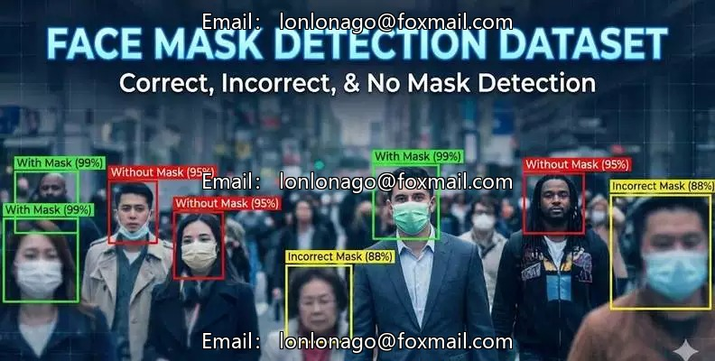
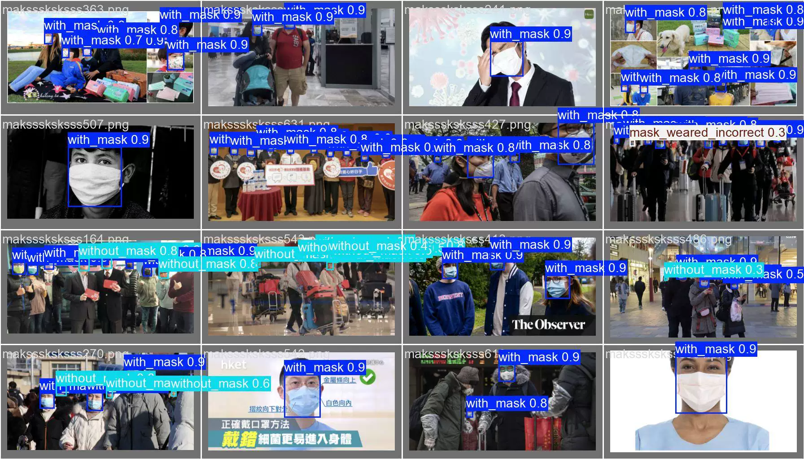
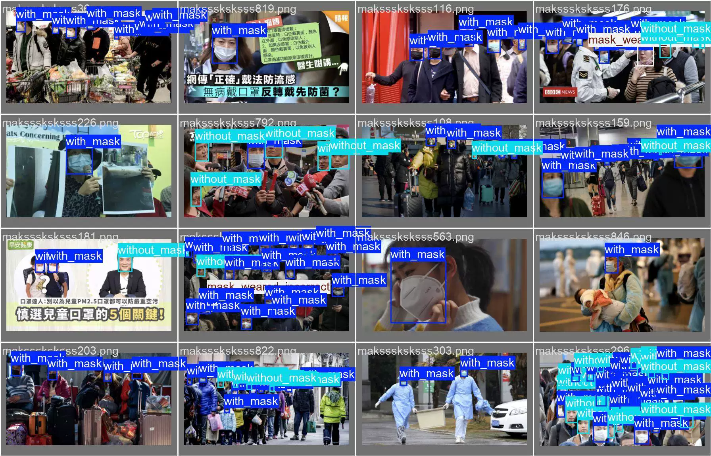
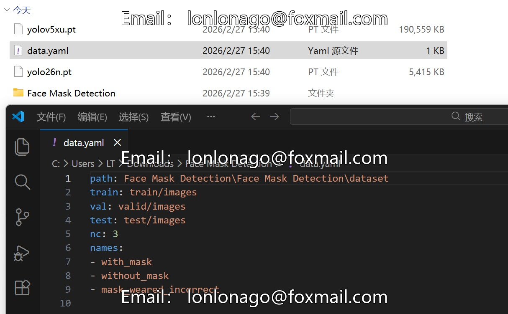

## Body

Detection dataset of face mask wearing condition in YOLO format

Only selling the dataset
Totally 1706 images, each labeled and divided into training set (1074), test set (171), validation set (461)

It is divided into three categories, which are "with_mask", "without_mask", "mask_weared_incorrect"
　　　　　　　　　　"Mask Wearing", "Not Wearing Mask", "Incorrect Mask Wearing"

mAP@50: 0.833

The annotation and image formats have been preprocessed and standardized to facilitate direct use in modern object detection frameworks (such as YOLO, Faster R-CNN, etc.)

Electronic virtual products sold without return or exchange.

## Images

item_1024264915936

Here is a pay link on Stripe ( https://buy.stripe.com/3cs8yP7sY87d0vu9AB ). Please contact me lonlonago@foxmail.com after funding $89, and I will send you a complete data files , thank you!

